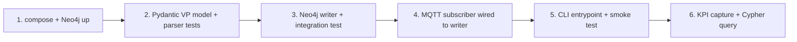

# Phase 1 Plan - Tiny End-to-End (MQTT direct to Neo4j)

> Owned by [`AGENTS.md`](../AGENTS.md). KPIs measured per
> [`kpis.md`](kpis.md). Retro logged in [`ai_log.md`](ai_log.md).

## Goal

Get the smallest possible end-to-end pipe working:

```
Digitransit MQTT  --[paho-mqtt subscriber]-->  Python parser  --[neo4j driver]-->  Neo4j
```

No Kafka. No Flink. No FastAPI. No dashboard. Just enough to answer one
Cypher query at the analyst's request:

> "What is the average delay (`dl`) per route over the last 15 minutes?"

If we can run that query against live HSL data and get sensible numbers,
Phase 1 is done.

## In-scope deliverables

1. **Subscriber** (`transitgraph/ingest/mqtt_subscriber.py`)
   - Connects to `mqtt.hsl.fi:8883` over TLS.
   - Subscribes to a topic filter pulled from env (default narrows to a few
     routes from `ROUTE_FILTER`).
   - Handles `on_connect`, `on_message`, `on_disconnect` with reconnection.
   - Emits parsed `VehiclePosition` objects to a callback (a Python function,
     not a queue or broker - that comes in Phase 2).

2. **Payload model** (`transitgraph/models/vehicle_position.py`)
   - Pydantic v2 model for the `VP`-wrapped payload. Top-level key in the
     wire JSON is `VP`; we model the wrapper as `VPMessage` and the inner
     record as `VehiclePosition`.
   - Required fields for Phase 1: `desi` (display line, e.g. "550" - the
     analyst-facing key), `dir`, `oper`, `veh`, `tst` (event timestamp,
     ISO 8601 UTC), `oday` (operating day), `start` (start time "HH:MM"),
     `route` (HSL *internal* route id, e.g. "2550" for line 550).
   - Nullable / sometimes-missing fields (observed in metro `loc:MAN`
     messages by the `scripts/mqtt_peek.py` spike): `stop`, `lat`, `long`,
     `dl`. Modeled as `Optional[...] = None`.
   - Trip identity: the `(route, dir, oday, start)` tuple. There is NO
     `tripId` field in the wire payload; the original plan was wrong on
     this point.
   - Tolerant parser (`parse_vp`): missing optional fields don't crash.
     Wraps Pydantic's `ValidationError` and `json.JSONDecodeError` in a
     typed `VPParseError`. Accepts `bytes`, `str`, or `dict` input.

3. **Neo4j writer** (`transitgraph/storage/neo4j_writer.py`)
   - Wraps the official `neo4j` driver.
   - Single Cypher: parametric `MERGE` for `Route` and `Vehicle`, then
     `CREATE` of a `DelaySample` node linked to both. Uses the timestamp
     from `tst`, not `now()`.
   - Idempotency: `(:Route {id})` and `(:Vehicle {id})` use `MERGE`;
     `DelaySample` uses a synthetic id `f"{vehicleId}-{tst}"` via `MERGE`
     so replays don't double-count.
   - Index DDL run once on startup:
     - `CREATE CONSTRAINT route_id IF NOT EXISTS FOR (r:Route) REQUIRE r.id IS UNIQUE`
     - `CREATE CONSTRAINT vehicle_id IF NOT EXISTS FOR (v:Vehicle) REQUIRE v.id IS UNIQUE`
     - `CREATE INDEX delay_sample_ts IF NOT EXISTS FOR (s:DelaySample) ON (s.ts)`

4. **Entrypoint** (`transitgraph/cli/run_phase1.py`)
   - Loads settings (`pydantic-settings`).
   - Wires subscriber -> parser -> writer.
   - Logs one INFO line every N messages with a small rolling rate.
   - Graceful shutdown on SIGINT (close writer's session, disconnect MQTT).

5. **Settings** (`transitgraph/config.py`)
   - `pydantic-settings` `BaseSettings` reading from `.env` and env vars.
   - Validates required URIs and credentials.

6. **Cypher query bundle** (`queries/avg_delay_last_15m.cypher`)
   - The one canonical query for Phase 1. Owner runs it from Neo4j Browser.

7. **Docker compose for Phase 1** (`deploy/phase1/docker-compose.yml`)
   - One service: `neo4j:5` with auth disabled in dev or password from env.
   - Volume for data so restarts don't wipe state.
   - `make up PHASE=1` brings it online.

## Tests

- `tests/test_vehicle_position.py` - parser unit tests, including:
  - Happy path with full payload from a captured fixture.
  - Missing optional fields don't break parsing.
  - Bad timestamp raises a typed error.
- `tests/test_neo4j_writer.py` (`@pytest.mark.integration`) - writes one
  sample, queries it back, asserts nodes/relationships count.
- `tests/test_run_phase1_smoke.py` (`@pytest.mark.integration`) - runs
  entrypoint against a fake MQTT publisher (a 10-msg loopback with
  `paho.mqtt.client.Client` against an embedded `aiomqtt` test broker, or
  by injecting messages directly into `on_message`). 5 sec budget.

## Phase 1 KPIs to record (subset of [`kpis.md`](kpis.md))

| KPI | Target |
| --- | ------ |
| S3 - pipeline lag p95 | < 5 s |
| Cypher query p95 (U1 stand-in) | < 200 ms |
| Owner can explain MQTT QoS in 5 sentences | Y |
| Owner can explain `MERGE` vs `CREATE` in 5 sentences | Y |

AI-agent KPIs (full Section C of [`kpis.md`](kpis.md)) are recorded in
[`ai_log.md`](ai_log.md).

## Out of scope (defer)

- Kafka (Phase 2).
- Windowed aggregates - Phase 1 stores raw samples; aggregation is a Cypher
  query at read time. Pre-aggregation is Phase 3's job.
- API or dashboard (Phase 4).
- GTFS validation of `dl` (Phase 5).
- TLS cert pinning, secrets manager, k8s deployment.

## Suggested sequence (small reviewable diffs)



Each numbered step is meant to be its own commit (and ideally its own AI
prompt batch), so the AI-agent KPI capture in [`ai_log.md`](ai_log.md) has
clear boundaries.

## Open questions to resolve at Phase 1 kickoff

1. **TLS vs plain MQTT** - HSL exposes both `mqtt.hsl.fi:1883` (plain) and
   `:8883` (TLS). TLS is the right default but needs `paho-mqtt` TLS config.
   Worth the extra step in Phase 1, or use plain and revisit later?
2. **Route filter** - default `.env.example` has `550,4,9`. Confirm or
   change before subscribing (volume goes up fast at "all routes").
3. **Neo4j password** - dev default `neo4j/changeme`, or disable auth in the
   docker-compose for local-only convenience?
4. **DelaySample retention** - Phase 1 has no TTL. Acceptable for a few
   hours of testing; Phase 5 should add retention or downsampling.
